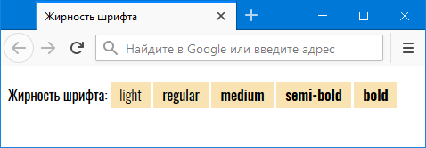
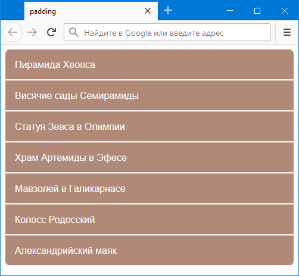
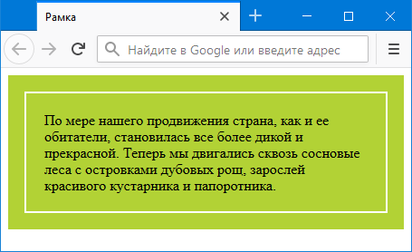

# webReference

here are my solutions of tasks from WebReference source

## Padding
1. First task: 
    1. Task: Создайте веб-страницу, как показано на рис.    
    
    1. Solution: [https://alexkuryanov.github.io/webReference/padding.html](https://alexkuryanov.github.io/webReference/padding.html)
1. Second task:
    1. Task: Cоздайте веб-страницу, как показано на рис.    
    
    1. Solution: [https://alexkuryanov.github.io/webReference/padding2.html](https://alexkuryanov.github.io/webReference/padding2.html)
## Border
1. First task
    1. Task: Создайте блок с рамкой, как показано на рис.     
        
    1. Solution: [https://alexkuryanov.github.io/webReference/border1.html](https://alexkuryanov.github.io/webReference/border1.html)
